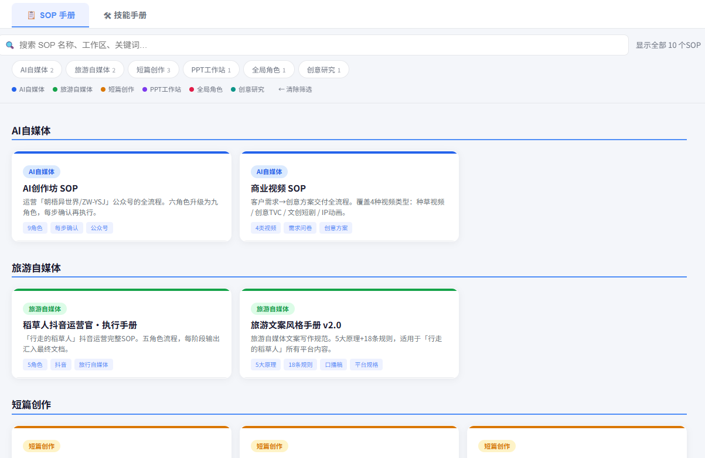
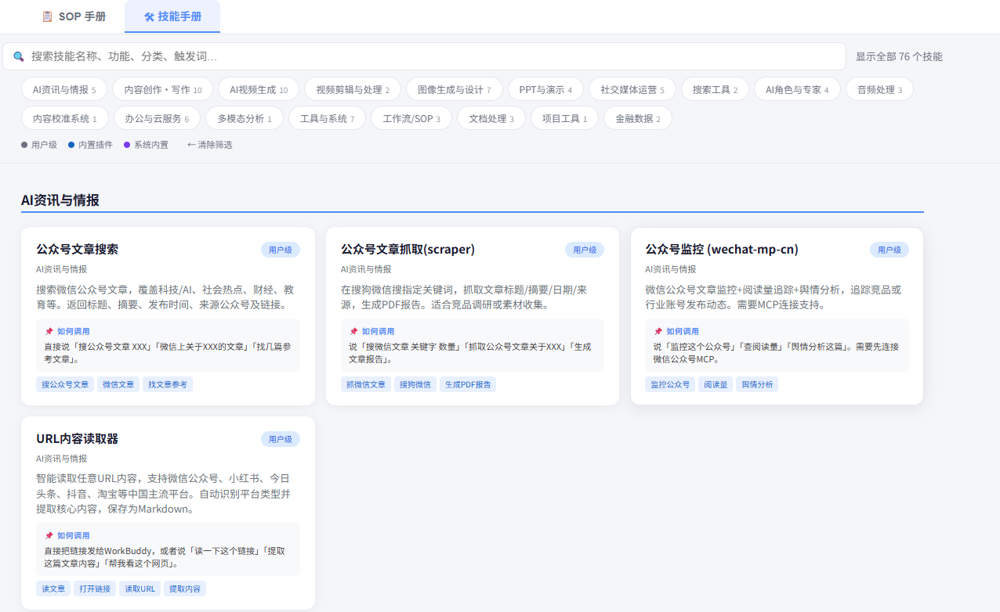

# SOP·Skill速查器

WorkBuddy装了太多节能和SOP记不住？
这个小工具自动扫描你安装的所有 WorkBuddy 技能和 SOP 工作流文件，生成一份完整的 **HTML 速查手册**。

---

## ✨ 功能特点

| 功能 | 说明 |
|---|---|
| 📋 双 Tab 手册 | SOP 手册 + 技能手册，点击顶部 Tab 切换 |
| 🔍 搜索筛选 | 支持关键词搜索、工作区筛选、技能类型筛选 |
| 📂 链接原文 | 每个卡片都有「原文」按钮，点击直接打开本地文件 |
| 🤖 首次引导 | 首次运行自动介绍，只需告诉它手册想保存在哪 |
| 🔄 自动更新 | 以后说「更新手册」自动重新扫描并更新 HTML |

---

## 🚀 安装方式

1. 下载本技能文件夹
2. 放到 `~/.workbuddy/skills/` 目录下
   - Windows：`C:\Users\你的用户名\.workbuddy\skills\`
   - macOS / Linux：`~/.workbuddy/skills/`
3. 重启 WorkBuddy

---

## 💡 使用方法

安装完成后，在 WorkBuddy 对话中说以下任意一句即可触发：

| 说这句话 | 效果 |
|---|---|
| `更新手册` | 扫描所有技能和 SOP，生成/更新完整手册 |
| `更新技能手册` | 只更新技能 Tab |
| `更新SOP手册` | 只更新 SOP Tab |
| `生成手册` | 同「更新手册」 |

---

## 📖 首次运行引导

第一次说「更新手册」时，会看到：

```
🧭 SOP·技能速查工具

【这个技能是干嘛的？】
自动扫描你安装的所有 WorkBuddy 技能和 SOP 工作流，
生成一份可搜索、可筛选的 HTML 速查手册。

【生成的手册有什么？】
- 📋 SOP 手册 Tab：所有 SOP 工作流，点击展开查看每一步
- 🛠 技能手册 Tab：所有技能，按分类展示，支持搜索筛选

【怎么用？】
以后只要说「更新手册」或「生成手册」，
我就会自动重新扫描并更新这份手册。

首次使用需要配置一件事：手册想保存在哪？
（例如：D:\My Documents\工作手册.html）
```

配置完成后，手册路径会保存下来，以后不再询问。

---

## 📖 手册预览

**SOP 手册 Tab：**


按工作区分类展示所有 SOP，点击卡片展开查看完整流程步骤，支持关键词搜索和标签筛选。

**技能手册 Tab：**


按分类展示所有已安装技能，支持搜索（名称/描述/触发词）和类型筛选，每个卡片显示功能说明和示例指令。

---

## 🔧 配置文件

首次运行后，配置保存在：

```
~/.workbuddy/skills/SOP·技能速查工具/config.json
```

内容示例：
```json
{
  "manualPath": "D:\\My Documents\\工作手册.html"
}
```

如需修改手册保存路径，直接编辑这个文件，或删除后重新运行「更新手册」触发引导。

---

## 📦 技能包内容

```
SOP·技能速查工具/
├── SKILL.md          # 技能主文件（WorkBuddy 读取）
├── template.html     # HTML 手册模板
├── generate.py       # Python 生成脚本
├── sop-preview.png   # SOP 手册截图
├── skills-preview.png # 技能手册截图
└── README.md         # 本文件
```

---

## ❓ 常见问题

**Q：扫描不到我的 SOP 文件？**
A：确保 SOP 文件放在工作区的根目录，或文件名包含「SOP」「流程」「手册」等关键词。也可以手动在 `config.json` 里添加额外扫描路径。

**Q：生成的 HTML 打开是空白？**
A：确保浏览器允许本地 HTML 运行 JavaScript（直接双击打开即可，无需服务器）。

**Q：我想分享手册给其他人？**
A：直接把生成的 HTML 文件发给他们即可，它是一个独立的单文件，不需要安装 WorkBuddy 也能查看。

---

## 🪪 作者

by 朝梧AI-ZHAOWU 🧭

如有问题或建议，欢迎反馈。
